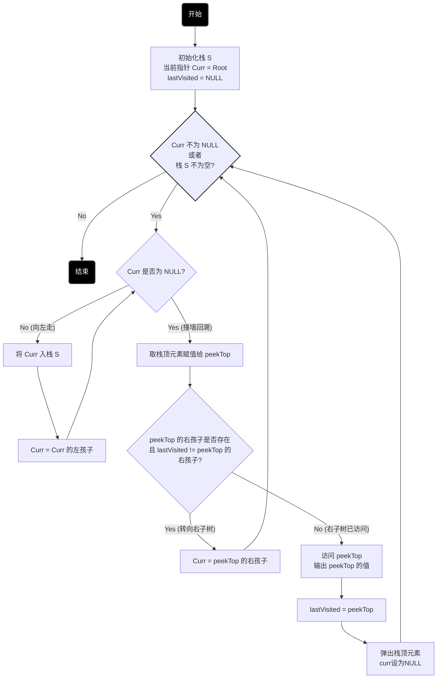

## 树的定义

### 基本术语

- 结点
- 边<m,n>, 从结点 m 到结点 n
- 叶子结点: 没有孩子的结点的结点
- 结点的度: 该结点所拥有的孩子结点的数量
- 结点的层数: 从根结点起开始定义, 根结点的层数为 0
- 森林: 森林是由 m(m≥0)棵互不相交的树组成的集合

### 树的基本性质

1. 树的结点数等于所有结点的度数之和加 1
2. 度为 m 的树, 其第 i 层上最多有$m^i$个结点 (根节点为第 0 层, $i \ge 0$)
3. 高度为 h 的树(深度为 h-1)、度为 m 的树至多有$\frac{m^h-1}{m-1}$个结点
4. 具有 n 个结点的度为 m 的树，其最小高度为$\lceil log_m(n(m-1)+1) \rceil$ ($\lceil x \rceil$表示向上取整)

## 二叉树

### 定义

所有结点的度小于等于 2 的树

### 几种特殊的二叉树

1. 完全二叉树
   一棵高度为 h 的二叉树，除最后一层以外的其他所有层上的结点数都达到最大值，二最后一层上的所有结点分布在该层最左边的连续的位置上。
   **特点**：完全二叉树的叶子节点只能在层次最大和次大的两个层次上出现。对任一结点，如果其左子树的高度为m，则其右子树的高度必为m或者m-1。

```
# 完全二叉树
      1          
     / \
    2   3
   / \  / 
  4  5 6      

# 非完全二叉树
      1
     / \
    2   3
   / \   \
  4  5    6
```

2. 满二叉树

3. 扩充二叉树

### 二叉树的存储结构

### 二叉树的遍历

#### BFS-层次遍历

非递归实现使用队列queue

若queue.front的孩子结点不为空，则将左右孩子依次添加到queue中，然后pop

#### DFS-先序、中序、后序遍历

先序、中序、后序非递归实现均使用栈stack

##### 先序遍历

主要循环：

当栈不为空时，弹出并访问栈顶元素1️⃣ -> 判断是否有右孩子（有就入栈）2️⃣ -> 判断是否有左孩子（有就入站）3️⃣ -> 回到1️⃣，开始新一轮循环

```mermaid
graph TD
    Start(开始) --> Init[初始化栈 S<br>将根节点 Root 入栈]
    Init --> IsStackEmpty{栈 S 是否为空?}

    IsStackEmpty -- Yes --> End(结束)
    IsStackEmpty -- No --> Pop[弹出栈顶元素<br>赋值给 P]
    
    Pop --> Visit[访问节点 P<br>输出 P 的值]
    
    Visit --> HasRight{P 有右孩子吗?}
    HasRight -- Yes --> PushRight[将 P 的右孩子入栈]
    HasRight -- No --> HasLeft{P 有左孩子吗?}
    
    PushRight --> HasLeft
    
    HasLeft -- Yes --> PushLeft[将 P 的左孩子入栈]
    HasLeft -- No --> IsStackEmpty
    
    PushLeft --> IsStackEmpty

    style Start fill:#000,stroke:#333,stroke-width:2px
    style End fill:#000,stroke:#333,stroke-width:2px
    style IsStackEmpty fill:#,stroke:#333,stroke-width:2px
```



##### 中序遍历

```mermaid
graph TD
    Start(开始) --> Init[初始化栈 S<br>当前指针 Curr = Root]
    Init --> MainLoop{Curr 不为 NULL <br>或者<br>栈 S 不为空?}
    
    MainLoop -- No --> End(结束)
    MainLoop -- Yes --> IsCurrNull{Curr 是否为 NULL?}
    
    IsCurrNull -- No (向左走) --> PushCurr[将 Curr 入栈 S]
    PushCurr --> MoveLeft[Curr = Curr 的左孩子]
    MoveLeft --> IsCurrNull
    
    IsCurrNull -- Yes (撞墙回溯) --> Pop[弹出栈顶元素<br>赋值给 Curr]
    Pop --> Visit[访问节点 Curr<br>输出 Curr 的值]
    Visit --> MoveRight[Curr = Curr 的右孩子<br>转向右子树]
    MoveRight --> MainLoop

    style Start fill:#000,stroke:#333,stroke-width:2px
    style End fill:#000,stroke:#333,stroke-width:2px
    style MainLoop fill:#,stroke:#333,stroke-width:2px
```



##### 后序遍历



