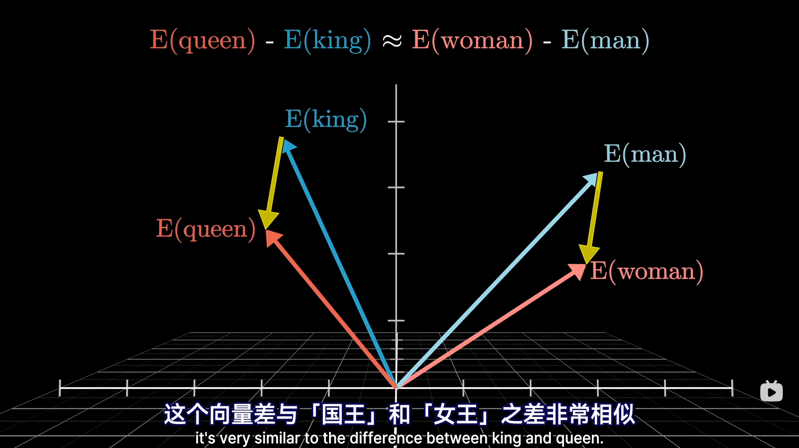

> Attention is all you need

## Transformer 架构

解决了循环神经网络 RNN 和长短期记忆 LSTM 的'慢'和'忘'的问题

慢：无法并行计算

忘：长距离依赖问题（读到后面容易忘记前面的内容）

### 核心：注意力机制

注意力机制可以描述为Query，Key，Value的交互

公式：$$Attention(Q, K, V) = \text{softmax}(\frac{QK^T}{\sqrt{d_k}})V$$

### 架构组成

Encoder，Decoder

### PS：

