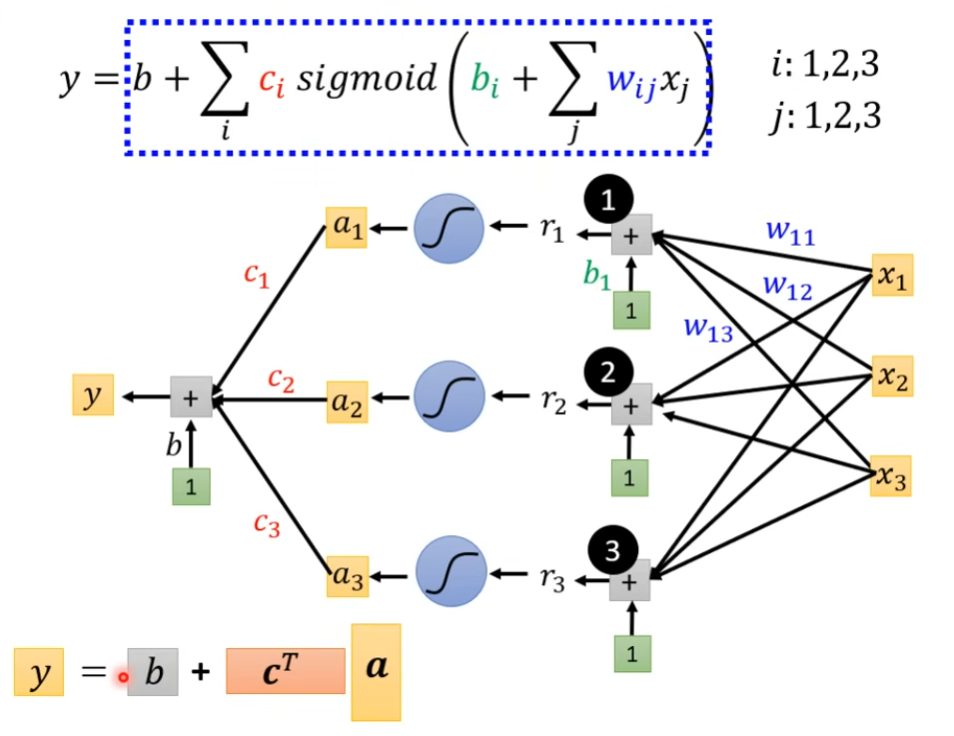
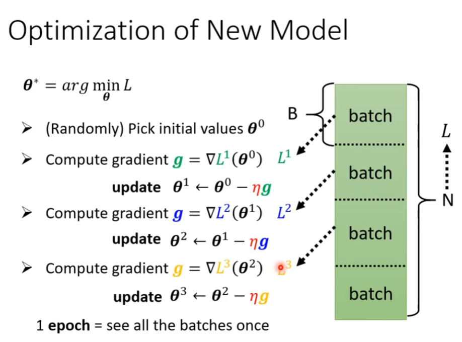
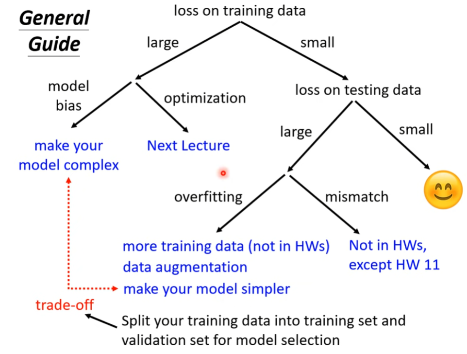

> 本笔记基于李宏毅老师的机器学习（2021）课程记录
>
> 课程背景：用已有的视频平台观看数预测第二天的观看数

## 机器学习

机器学习主要分为三个步骤

1. 定义带有未知参数的函数（模型）
2. 定义损失函数
3. 选择优化器

## 定义函数

函数分为**线性和非线性**

当我们预测的目标是连续数据型变量，我们就称之为**回归**

### 线性回归

一个简单的线性回归如：y=wx+b，其中我们称 w 为权重，b 为偏差。

它们的英文分别为**weight，bias**

### 非线性回归

sigmoid 函数

$$
y=c\frac{1}{1+e^{-(b+wx_1)}}=csigmod(b+wx_1)
$$

ReLU 函数

$$
y=max(0,x)
$$

以上也称为激活函数

### 模型

模型是多种函数结合的结果

DNN（Deep Neural Network）深度神经网络

---

我们将 w、b 等所有的未知参数统称为 θ

θ 可以通过设置 batch_size 划分为多个相等的 batch

我们通过一个一个的 batch 来计算 loss，然后再计算梯度

batch 的数量等于 1 个 epoch 的更新参数的次数

1 个 epoch = 把所有的 batch 都看过一遍

### 损失函数

MSE（均方误差）

### 优化器

SGD（Stochastic Gradient Descent）随机梯度下降

## 如何训练（模型训练不起来怎么办）

### 总体指导

模型的 bias:

model 设计过于简单，如线性回归模型永远只能是一条直接，只有加入了 sigmoid 或者 relu 才能变成曲线

### 局部最低点和鞍点

Hessian Matrix 海森矩阵
